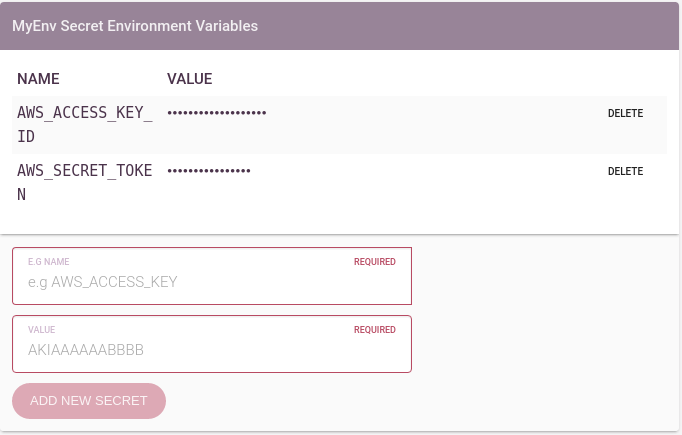

Environment Secrets
===================

Environment secrets are exported to the containers the same way as Environment
Variables, however they have additional security around them.

Project owners and managers can see the secret name (it's
``EXPORTED_NAME_ON_THE_ENV``), as well as it's value. Project members can only
see the name.

Some tools, noteably ``aws-cli`` as in the example will read their
configuration from variables on the environment, or from files, etc. This makes
it very easy to export a secret to the environment and have the tooling pick it
up automatically, in cases where that doesn't work, or is not posible it might
be required to write them into a file:

.. code-block:: bash

  #!/bin/bash -e

  echo "---"                                     > aws-credentials.yaml
  echo "\taccess_key_id: \"$AWS_ACCESS_KEY_ID\"" > aws-credentials.yaml
  echo "\tsecret_token: \"$AWS_SECRET_TOKEN\""   > aws-credentials.yaml

This example creates a file `aws-credentials.yaml` which is readable by most
programming languages without special libraries. Any other format should be
possible using a similar technique, or as an alternative, an example in Ruby:

.. code-block:: bash

  #!/usr/bin/env ruby -w
  require 'yaml'

  File.open('aws-credentials.yaml', 'wb') do |file|
    file.write(YAML.dump({
      access_key_id: ENV['AWS_ACCESS_KEY_ID'],
      secret_token: ENV['AWS_SECRET_TOKEN'],
    }))
  end

  system('continue-with-some-other-script.sh')

As is clear from the examples, doing this is a little awkward. It is often
better to symetrically encrypt secrets in a repository using something like
``gpg`` and decrypt them at runtime using a secret passphrase stored as a
Harrow secret.
