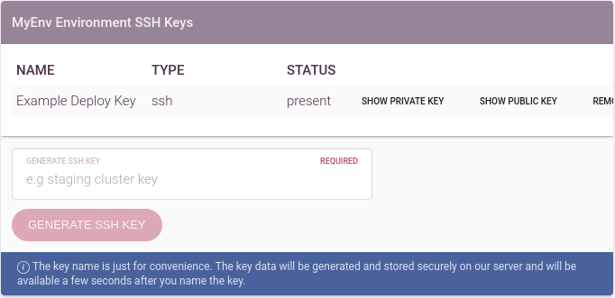
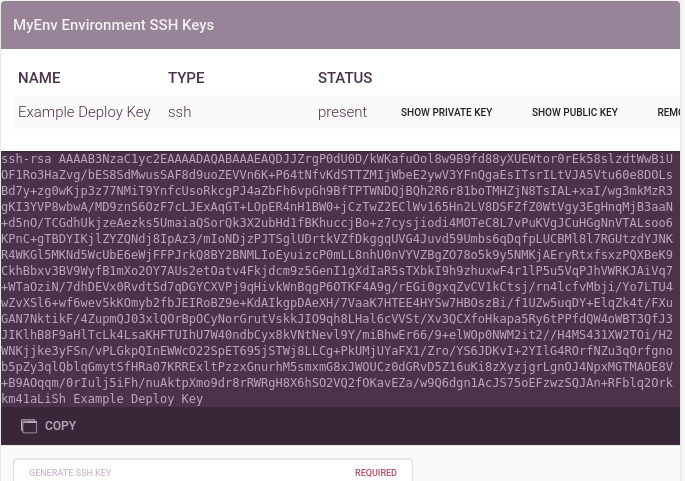
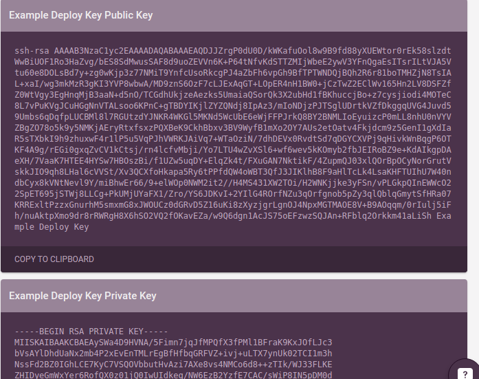

Environment SSH (Deploy) Keys
=============================

Harrow manages SSH deploy keys for each environment. The intention is that you
can generate unique and strong keys in Harrow, giving the jobs that use your
*Production* environment different access to those on the `Staging` environment.

Harrow SSH (deploy) keys need a name to identify them, but the name is
infrequently used, simply as a label to help identify their purpose.

Harrow requires a few seconds (upto 30s) to collect enough secure entropy to
generate the most secure key possible.

The list does not show the secret bytes of the key, this is behind the key icon.

Behind the key icon is the *Public Key* , this is the part that should be distributed.

In order to give Harrow access to that server as the user who owns that file, you need to add this public key to your server's ``~/.ssh/authorized_keys`` file :

.. code-block:: bash

 $ ssh root@SERVER_IP_ADDRESS

It's recommended not to use root user for deployment and create a dedicated users instead. If you already have a “deploy” user on you server you can skip the next 2 steps.

.. code-block:: bash

 $ adduser deploy
 $ passwd -a deploy sudo

Create a file to store your SSH key. For convention, we call this file authorized_keys and it must be in the hidden folder  ~/.ssh :

.. code-block:: bash

 $ su – deploy
 $ mkdir ~/.ssh
 $ nano .ssh/authorized_keys

Paste the public key that you generated in the Harrow environment. Save with :kbd:`ctrl+X` :kbd:`Y` :kbd:`enter`
Now your server is accessible via SSH from the Harrow environment selected.
For security, it's important to restrict the permissions of the authorized_keys file:

.. code-block:: bash

 $ chmod 0700 ~/.ssh
 $ chmod 0600 ~/.ssh/authorized_keys

.. important::
  The public key is the only part that should ever leave Harrow. It is
  absolutely safe to publish the public key.

Behind the padlock icon is the *Private Key*, under normal circumstances you
never need this part of the key, but we make it available for debugging, or
your own backup, archival or audit purposes.

.. warning::
  Don't give this private key to anyone, it is a key to any server or resource
  where the public key has been installed.

.. note::
  Harrow's containers run with SSH `agent forwarding`_ enabled! This is not
  harmful if you connect to servers you control and trust. Ping us if you would
  like more information about the implications of this default.

.. _agent forwarding: http://linux.die.net/man/1/ssh-agent

