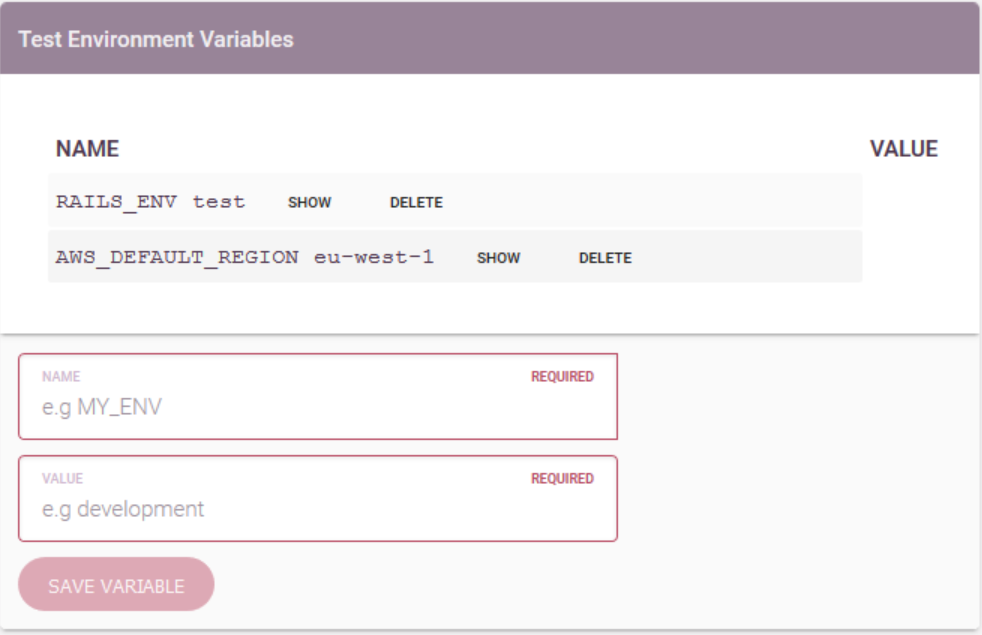

Environment Variables
=====================

Environment variables are a set of dynamic named values that can affect the way
running processes will behave on a computer. They are part of the environment
in which a process runs.

You may be familar environment variables from commands such as:

.. code-block:: bash

  $ export PATH=/my/new/directory:$PATH

Which is often used to modify the ``PATH`` environment variable to allow your
shell to find other executables.

Other common variables are ``RAILS_ENV``, ``DRUPAL_ENV_NAME``, etc.

They can be set in Harrow by managers and owners of a project by editing the environment:

