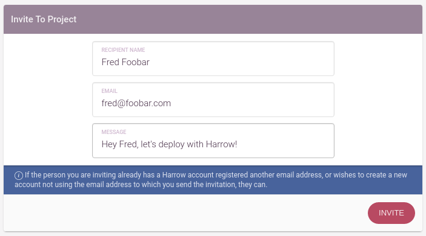
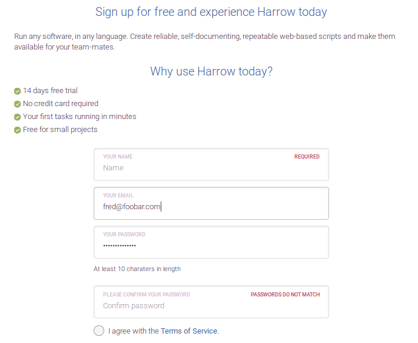
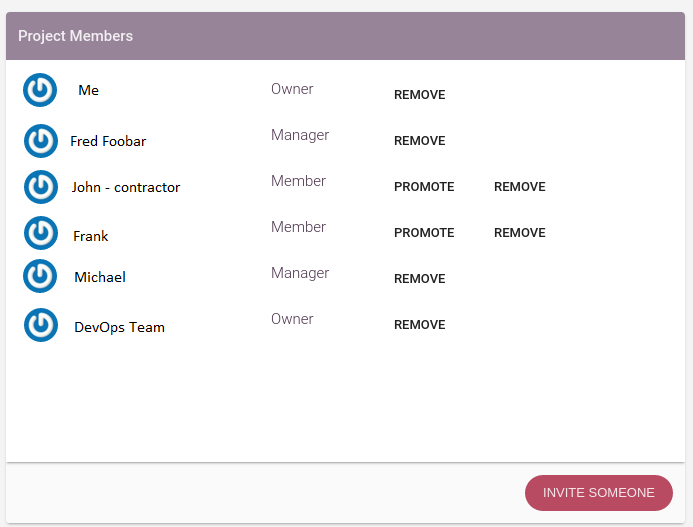

Work with collaborators
=======================

Harrow is a great tool for team collaboration and it's very easy to invite your team and work together on your project.

From the project settings, in the People tab you can start inviting your collaborators

They will receive an email
.. figure:: ../mini-guides/invites/email.png
   :align: center
   :scale: 50 %

And they can accept the invitation with one click.

NB: If the person that you want to invite is logged in with an existing account they will accept the invitation as the user they are logged in as, so not necessarily with the email to which the invite was sent to.

.. figure:: ../mini-guides/invites/email2.png
   :align: center
   :scale: 50 %

If the new user deosn't have an account, he will be prompted to tha sign up page.

You can easily manage the team members, promoting the memebers to Manager or Owner role.  

