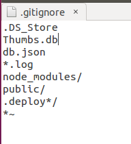
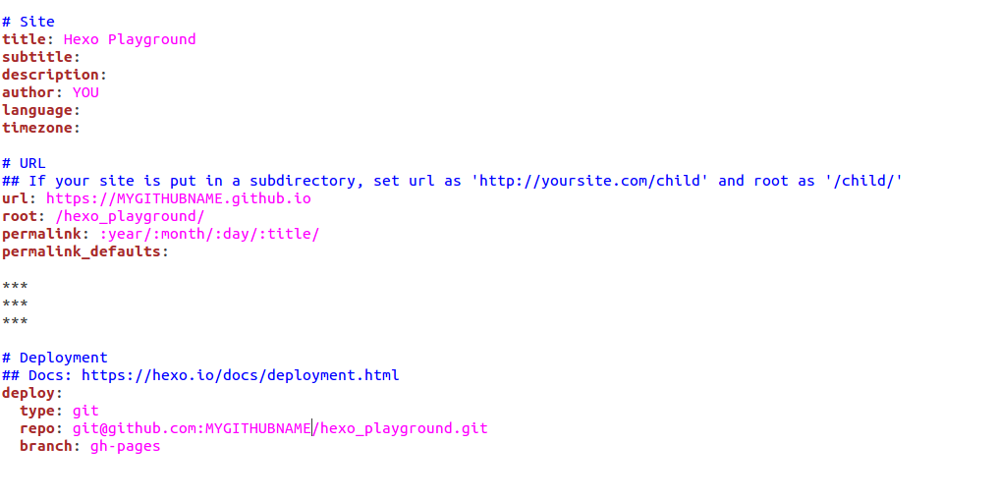

Hexo Blog deployed with Harrow
==============================

This tutorial will show you how to create an Hexo Blog, publish it to Github pages and automate your deploys with `Harrow`_.

If you already have an Hexo_ blog and want to deploy it in one click, jump here_

Create your Hexo Blog:
----------------------

1. Install Hexo on your laptop

* *Requirements:*   `Git`_ and `Node.js`_  ( `How to install`_ )

.. code-block:: bash

 $ npm install -g hexo-cli

2. Create a new git repository at GitHub (e.g. hexo_playground)

* Sign in to GitHub_ and create a new repository
* NB! Create it as empty repository

3. Set up your Hexo Blog using the hexo docs.

.. code-block:: bash

 $ hexo init <folder>    #in the example we will call the folder and the github repo “hexo_playground”
 $ cd <folder>
 $ npm install

4. Add " *~ " to the gitignore file to avoid backup files to be generated:

.. code-block:: bash

 $ gedit .gitignore

* Save

5. In the hexo_playground folder just created, edit the _config.yml file changing these fields:

* Save

6. Deploy the blog to `GitHub Pages`_ once manually:

.. code-block:: bash

 ~/hexo_playground$ git init
 ~/hexo_playground$ git remote add origin git@github.com:$YourGitHubName/hexo_playground.git
 ~/hexo_playground$ git add .
 ~/hexo_playground$ git commit -m “my first hexo commit”
 ~/hexo_playground$ git push –u origin master
 ~/hexo_playground$ npm install hexo-deployer-git --save
 ~/hexo_playground$ hexo deploy

7. You can check the result at http://YourGitHubName.github.io/hexo_playground

Now make all this automatic
---------------------------

1. Sign up to `Harrow`_

2. `Create a new project`_

3. `Add your Github repo into Harrow project`_

4. Create a new Harrow task, which installs Nodejs and Hexo and then runs hexo deploy commands. In this case:

.. code-block:: bash

 #!/bin/bash -e
 curl https://raw.github.com/creationix/nvm/master/install.sh | sh
 . ~/.nvm/nvm.sh
 nvm install 4
 npm install -g hexo-cli

 cd ~/repositories/$my_github_repo
 npm install
 hexo deploy --generate

5. Create an Harrow job selecting Default Environment and the newly created task

6. In the folder ~/hexo_playground/source/_posts , edit the file hello-world.md

.. code-block:: bash

 $ git add .
 $ git commit
 $ git push

7. Run the Harrow task and see that the changes are reflected in your Blog

8. Create a Webhook_ in the Harrow project page and paste the link to your Github settings/webhooks

.. _Harrow: http://harrow.io#Harrow
.. _Git: http://git-scm.com/
.. _Node.js: https://nodejs.org
.. _Create a new project: https://kb.harrow.io/quickstart/rails-app.html#setting-up-an-organization-project
.. _Add your Github repo into Harrow project: https://kb.harrow.io/quickstart/rails-app.html#adding-and-connecting-a-git-repository
.. _Webhook: https://kb.harrow.io/mini-guides/jobs-triggering-jobs.html#create-a-webhook
.. _here: #now-make-all-this-automatic
.. _Hexo: https://hexo.io#Hexo
.. _How to install: https://hexo.io/docs/index.html
.. _tutorial: #create-your-hexo-blog
.. _GitHub: https://github.com#GitHub
.. _GitHub Pages: https://pages.github.com
