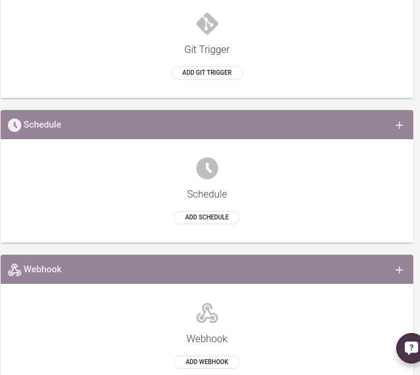
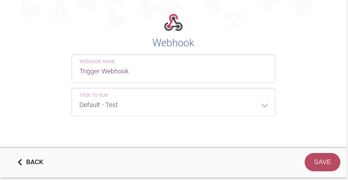
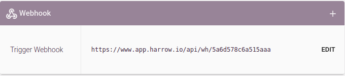

Jobs Triggering Other Jobs Mini-Guide
=====================================

Sometimes you want one job on Harrow to trigger another one.  The
typical example is running the tests on master and if that succeeds
trigger a deploy to the staging environment.

Even though there is no explicit feature on Harrow for triggering jobs
from jobs, it is possible to trigger other jobs by leveraging webhooks.

For the purposes of this guide we are going to assume that you have
two jobs, ``Staging - run tests`` and ``Staging - deploy``.  When
``Staging - run tests`` succeeds, ``Staging - deploy`` should be
triggered.

Create A Webhook
----------------

The first step is to create a webhook for the job we want to trigger,
``Staging - deploy`` in this case.  For this we need to go to the *Edit
Project* page:

*1- triggers page*

*2- add webhook*

3- copy webhook

Any requests sent to this URL will trigger the selected job.  Copy
this URL, as we need it in the next step.

Trigger The Webhook From Your Task
----------------------------------

The ``run tests`` task in this example looks like this:

.. code-block:: sh

   #!/bin/bash -eu
   #
   # "run tests" task
   cd ~/repositories/my-app
   ./bin/run-tests

We need to change the task to trigger the next job if
``./bin/run-tests`` is unsuccessful.  This can be done by making a
request to the URL copied in the previous step.  If this URL is
e.g. ``https://www.app.harrow.io/api/wh/80101883282eb9d9``, the
updated task would look like this:

.. code-block:: sh

   #!/bin/bash -eu
   #
   # "run tests" task
   cd ~/repositories/my-app
   if ! ./bin/run-tests; then
       curl -X POST https://www.app.harrow.io/api/wh/80101883282eb9d9
   fi

A small problem
----------------

As is stands now, the ``run tests`` task triggers ``Staging - deploy``
regardless of the environment in which the tests are run.  Introducing
a new job ``Production - run tests``, to run the tests of code which
is about to be deployed to production, will also trigger ``Staging -
deploy`` every time it runs successfully.  This is a problem because
we want to deploy code to ``Production``, not ``Staging`` again.

This problem can be solved by setting an environment variable about
which job to trigger after a successful run of the tests.

For the ``Staging`` environment, we set ``TRIGGER_AFTER_TEST`` to the
webhook url, ``https://www.app.harrow.io/api/wh/80101883282eb9d9``.

We then repeat the first step and create a webhook for triggering
``Production - deploy`` to deploy new code to our production servers.
The url of this webhook is then used as the value of
``TRIGGER_AFTER_TEST`` in the ``Production`` environment.

Now we can change the task to make use of this new variable:

.. code-block:: bash

   #!/bin/bash -eu
   #
   # "run tests" task
   cd ~/repositories/my-app
   if ! ./bin/run-tests; then
       [ -n "$TRIGGER_AFTER_TEST" ] &&
       curl -X POST "$TRIGGER_AFTER_TEST"
   fi

This version of the ``run tests`` task checks whether a variable
``TRIGGER_AFTER_TEST`` is set, and makes a ``POST`` request to the URL
contained in that variable if it is set.  With this little change the
``run tests`` task works for every environment.
