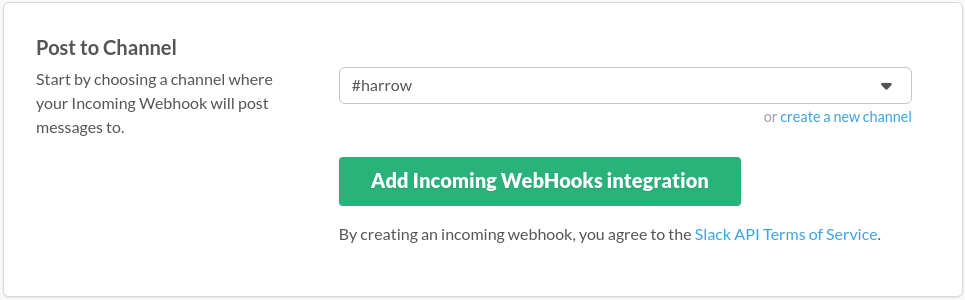
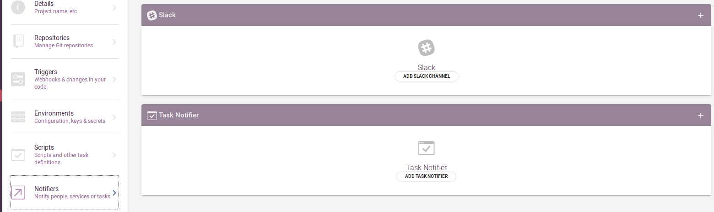
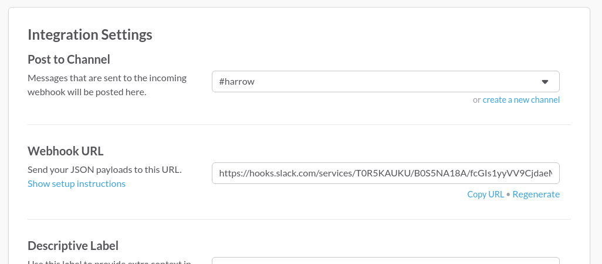
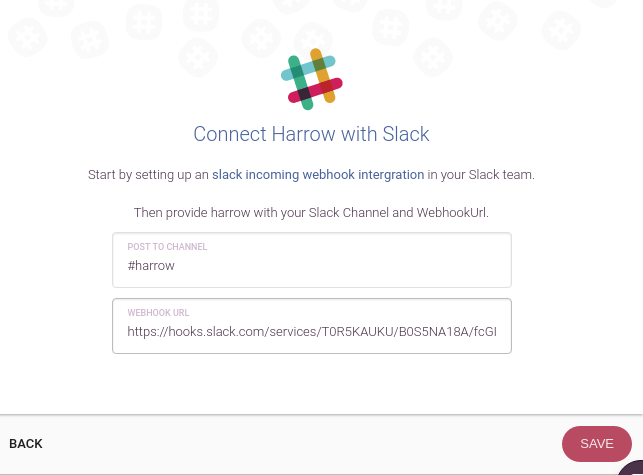
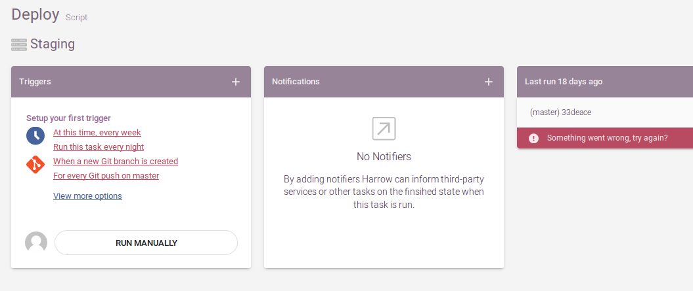
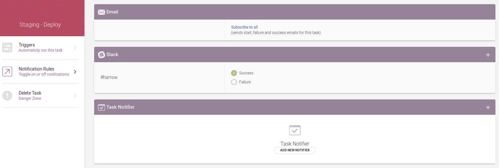
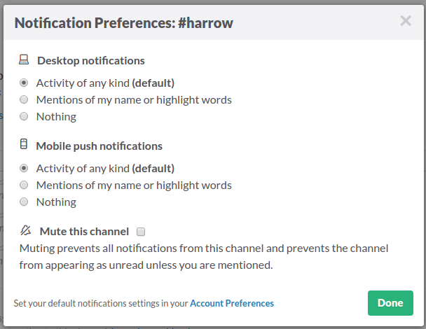
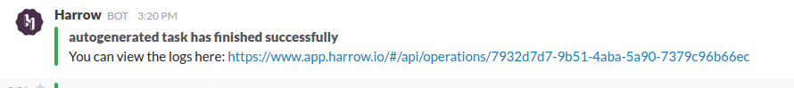

Slack Notifier
==============

Harrow can send notifications to let you know about the success or failure of your task with a message to your Slack.
You can easily configure this service as follows:

Generate a Slack Webhook
------------------------

* Login to Slack
* Go to `Slack incoming webhook setup page`_ 
* Select the channel where you want to be notified
* Click “Add Incoming WebHooks Intgration” button

Add your Slack webhook to Harrow
--------------------------------

* Login to Harrow
* Select the project  and go to settings

* In the “Notifiers” tab, click on add Slack notifier

   
* Paste the webhook URL that has been generated in Slack to the “webhook URL” field and add the #channel to the field above

*copy the link from Slack*

*paste the URL to Harrow* 

* Go to your Dashboard and click on the task that you want to be notified about

* Add a “Notification” by clicking on the + sign

* At the bottom of the page select in which case you want to be notified: “success” or “failure” of your task

* Back to your Slack, click on the setting gear and make sure that the "Notifications settings" are set correctly 

* When your task complete, you will receive a notification from Harrow in the selected Slack channel

.. _Slack incoming webhook setup page: https://my.slack.com/services/new/incoming-webhook
