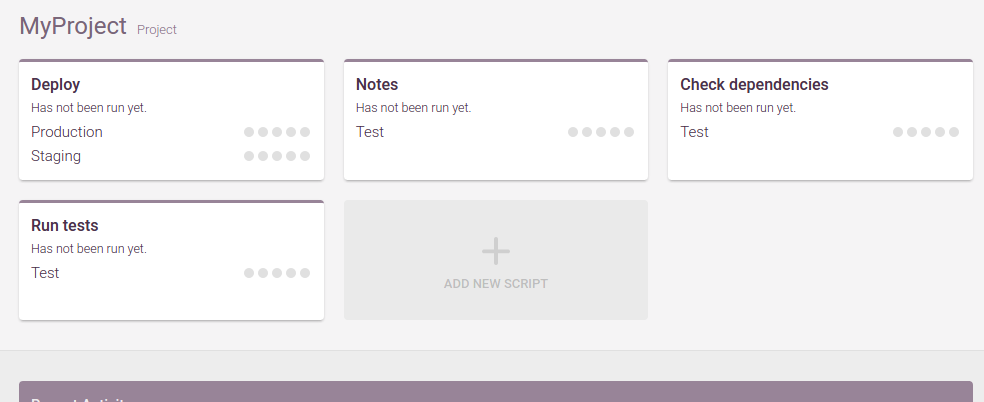
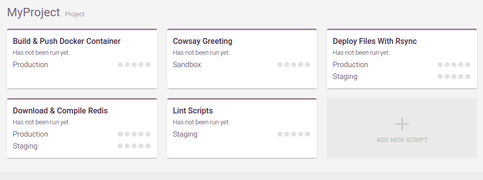
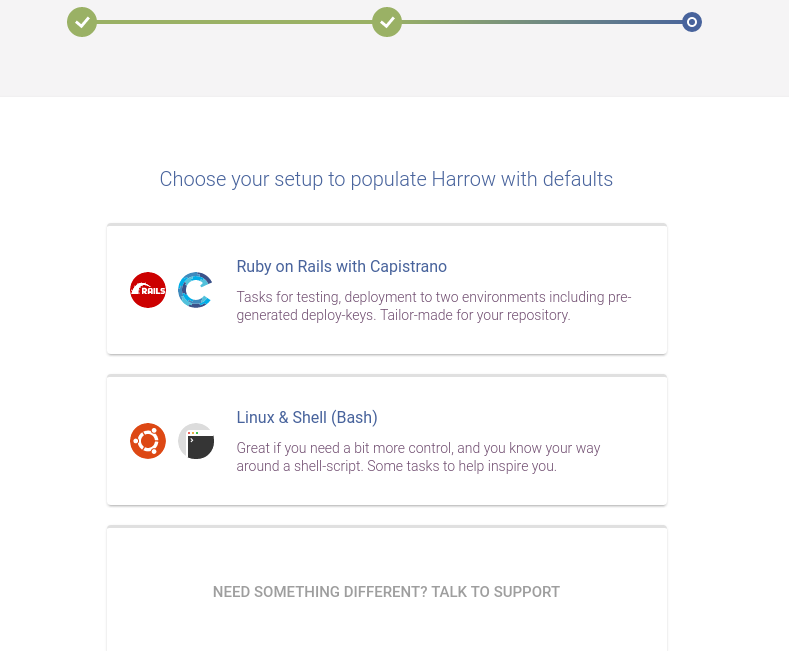
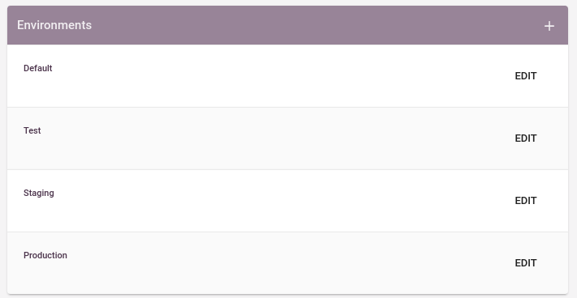
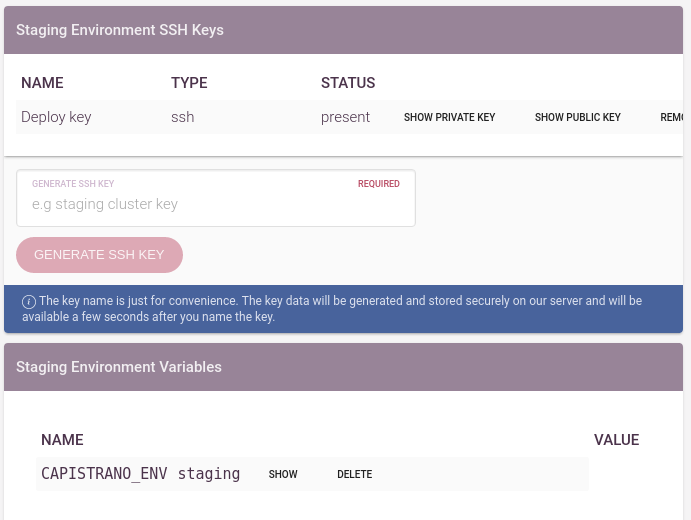
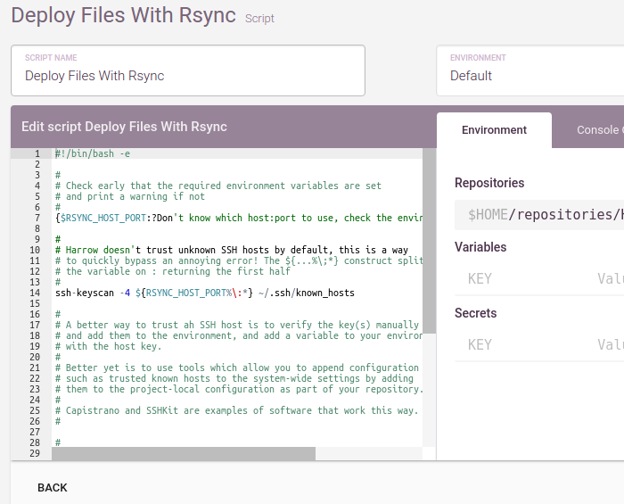

Stencils
========

A stencil is a pre-made Harrow project where all you need is already configured for you.

Just select the stencil matching your needs when adding your project to Harrow.
At the moment we have 2 stencils, one for Ruby and Capistrano and the other plain and adaptable to any Linux shell script.

Once the stencil is chosen, you can simply edit the environments and scripts according to the needs of your project.

And that's all, your project is ready in no time.

