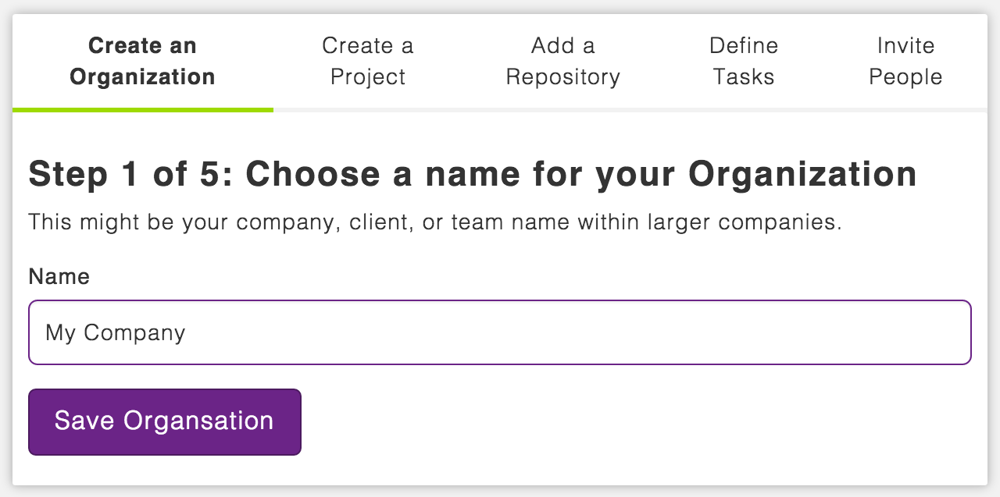
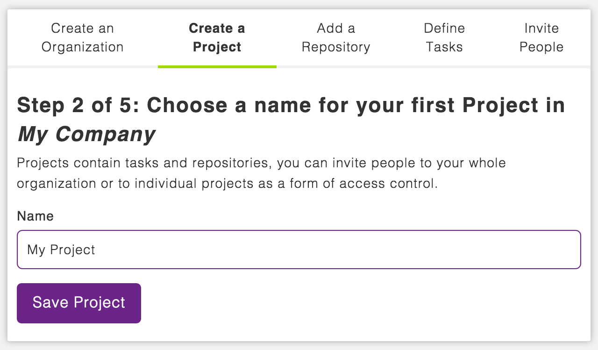
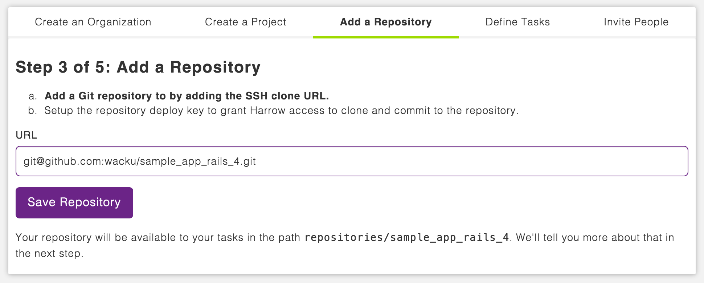
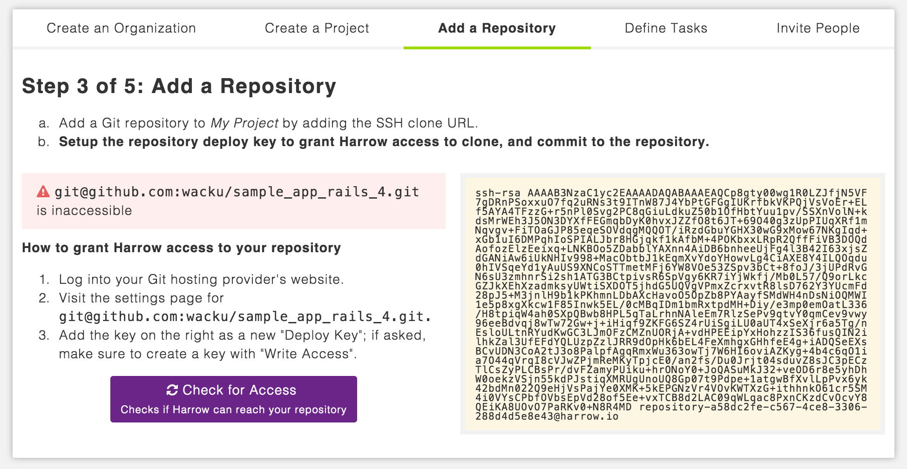
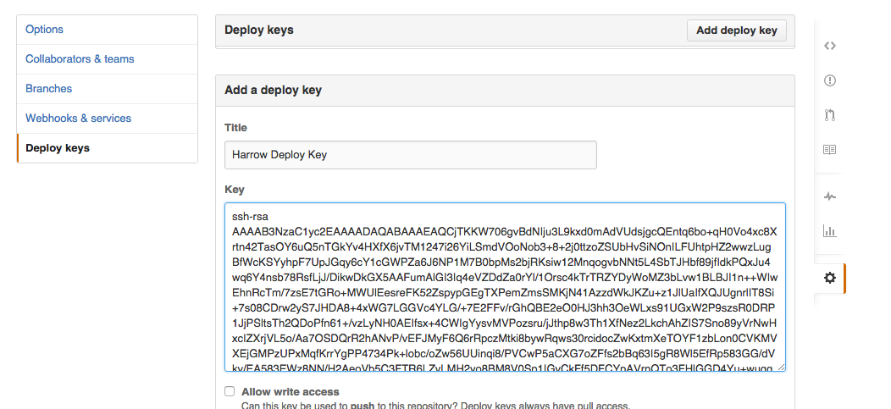
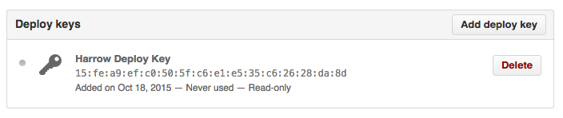
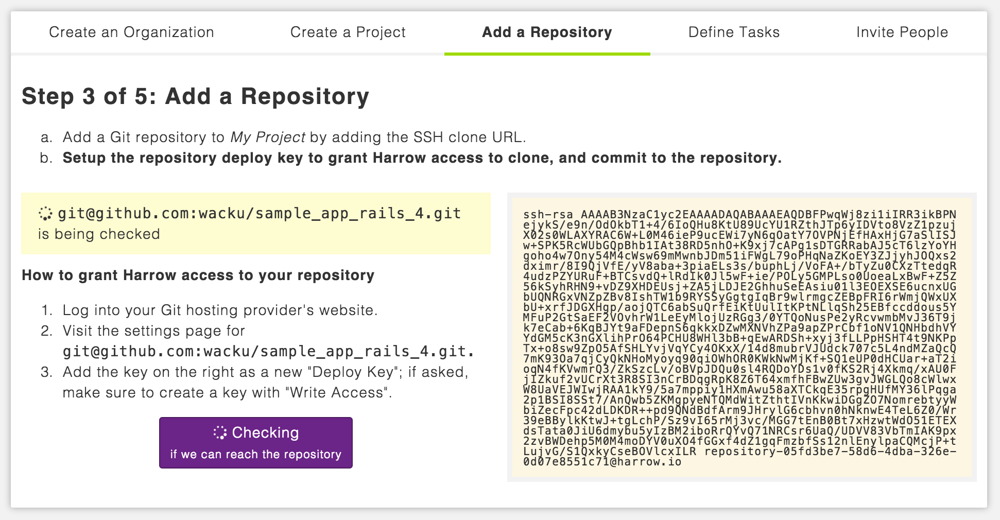
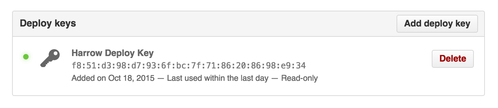

Setting up an Organization & Project
------------------------------------

Create an Organization, Organizations might be you indivudally, or your team or
company. An organization can have multiple projects within the limits of their
payment plan.

Projects can be used to separate entire projects and teams, or as separate
components within your organization.

An ideal configuration might be to have one Organization for your `company`
with one Project for the different parts of your application, frontend,
rails-application backend, CMS, wordpress theme, styleguide, etc could be
individual Projects.

Adding, and connecting a Git repository
---------------------------------------

Harrow ideally needs access to a Git repository to work, whilst some useful
things such as uptime checks and similar can be done with simple tasks, more
complex tasks such as testing, and subsequently deploying an application need a
Git repository.

Our Organization setup process will guide you through the process of adding a
repository to your Project and making sure that it's accessible.

.. note::
  Be sure to use the Git+SSH clone URL beginning with ``git@...`` or
  ``git+ssh://git@...``, using dedicated deployment keys is only possible this
  way, and dedicated keys are more secure and easier to audit and keep safe.

First type or paste the SSH clone URL into the repository URL field, and click
"Save Repository":

If this is a private repository, as is always nearly the case with SSH clone
URLs we'll not be able to access it until you install a deploy key, on the next
page of the form one will be generated for you.

.. hint::
  If your repository is public, and you don't need to push tags, branches or
  make changes, it would be fine using the public, HTTP(S) clone URL.

Note now, we've checked the repository and found it to be inaccessible, to
grant Harrow access we have to take the deploy key and add it to our Git host's
repository deploy keys. (Github is shown, but any Git provider that works with
SSH will work similarly).

Adding the deploy key to Github, we'll be asked for our password to confirm,
and other collaborators will be notified by email by Github.

Immediately in the Github interface we can see that the key has never been used,

Returning to Harrow we can now check the repository for accessibility, the
check takes a moment to verify that your repository is reachable:

.. figure:: add-repo-accessible.png
  :width: 550px
  :align: center
  :figclass: align-center

With a reachable repository reported, we could see at Github that the deploy
key was used recently, and that everything is wired up correctly so far.

At this point we break out of the setup process, but if you are just trying
Harrow for the first time it may make sense to follow the setup process to
completion, for this guide we don't need to.
