Harrow quick start guide for a Rails Application
================================================

This is a quickstart tutorial to running a simple Capistrano based deployment
of a Ruby on Rails project.  At the end of the guide we will explore how using
Environment Secrets might help us managing Rails' ``secrets.yml`` to keep
sensitive tokens out of our source control.

.. include:: _setup_org_project_repo.rst

Defining an Environment
-----------------------

From the empty project dashboard of `My Project` where we just added our Rails
app's repository, we can click the sprocket icon in the breadcrumb bar to edit
the project settings.  We're going to use this page to define a new *Environment*.

.. hint::
  If you come from a technological background, such as from Rails or
  from Capistrano, the idea of `Environments`, sometimes called
  `Stages`, will be familiar to you.  It is the idea of running the
  same chunk of code in two or more different settings, connected to
  different servers, configurations, or with different access
  control.  In Harrow it is possible too, by defining *Tasks*, which run
  in one or more environments, to reduce code duplication, and
  encourage reuse and modularity.

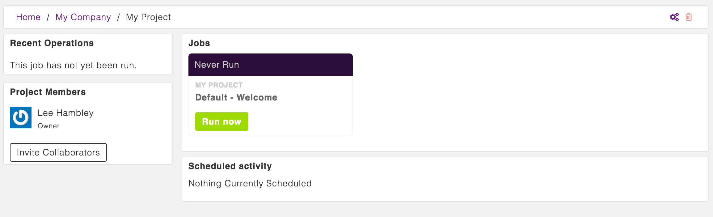

We'll define two Environments: one for `testing` and one for our `staging`
server.  The process is simply repeated twice...

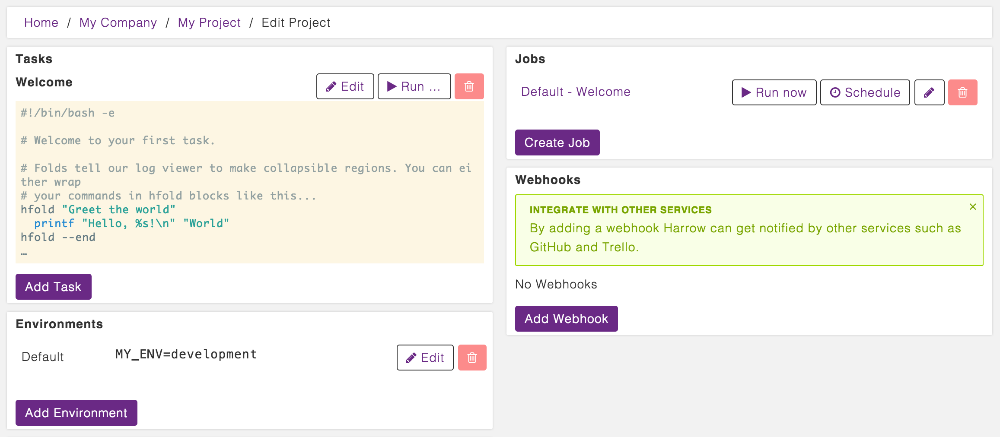

From the edit Project page we create two environments.  From the
first, "Testing", we simply define a new variable ``RAILS_ENV=test``.
This allows us to run the Rails test suite in test mode.  For the
second we define ``RAILS_ENV=staging``, which we can use to forward to
our servers, amongst other things.

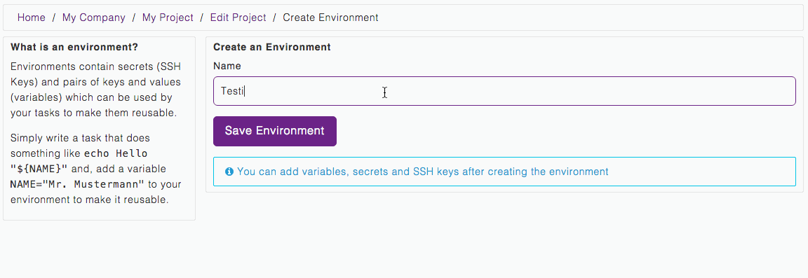

Whilst we're in the `Staging` environment, we also take the
opportunity to generate an Environment SSH key.  You can use this key
to selectively give tasks running in the *Staging* environment of your
Harrow project access to your staging servers.  You might use another
key from another environment to give Harrow production access, for
example.

.. figure:: why-two-keys.png
  :align: center
  :figclass: align-center

.. hint::
  There is potentially a third connection required, when your servers
  in turn need to access your source code at Github.  Harrow makes use
  of a common technique called SSH Agent Forwarding to allow you to
  reuse your Harrow repository deploy key to automatically grant your
  servers the same permissions at Github that your Harrow account has.

Defining our first Task
-----------------------

Our first task is really simple, we need to run the unit tests, and make sure
that the application is at least basically working.

.. code-block:: bash

  #!/bin/bash -e

  rbenv local 2.2.2

  (
    cd repositories/sample_app_rails_4
    bundle install
    cp config/database.yml{.example,}
    bundle exec rake spec
  )

We'll set this task up in Harrow in a moment, but first a quick note about what
we're doing:

1. The first line declares that this is a Bash script.
2. We use ``rbenv`` to select Ruby version 2.2.2.  You can learn more about using other `language runtimes here`_.
3. We then open a subshell_, this is just a style thing and is totally optional.
4. We change into the directory ``repositories/sample_app_rails_4`` where our repository will be automatically checked out.
5. We use ``bundle install`` to install the Ruby Gem dependencies. This should look familiar if you've done any Ruby development.
6. We copy the ``database.yml.example`` to ``config/database.yml`` using a neat `shell brace expansion`_ construct, we could also write this file to disk with a `here-document`_.
7. We run ``rake spec`` with Bundler.

.. hint::
  Our example ``database.yml.example`` uses SQLite3, but if your
  application needs another database you can easily start any version
  you like.  Check out our `databases and services documentation`_.

There are a handful of improvements we can make to this script, but let's get it running first...

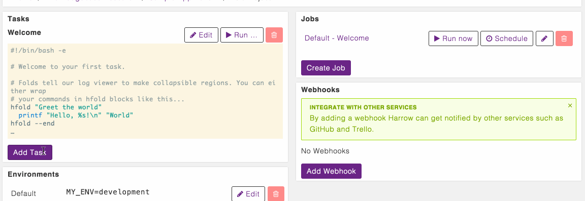

When running the *Task*, we were asked which *Environment* we wanted to run it
within.  This shortcut interface sets up a job for us, that becomes visible on
the dashboard, allowing one-click access to run this *Task* in the
pre-selected *Environment*.  This privilege is reserved for project managers
and owners.  Once a *Job* has been defined from the combination of a *Task* and an
*Environment* it becomes visible on the dashboard:

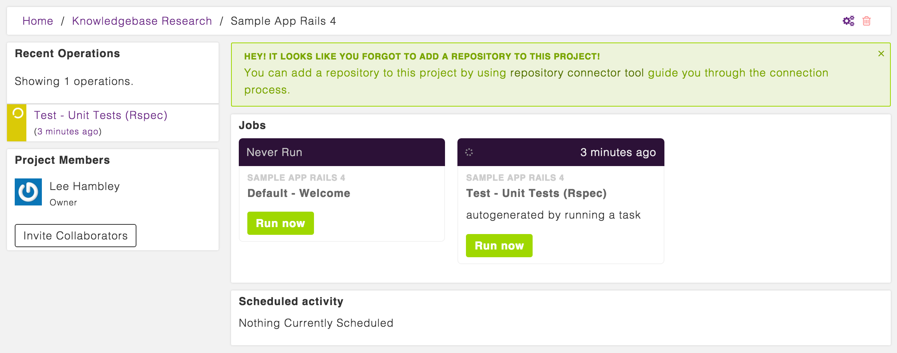

Improving this task
~~~~~~~~~~~~~~~~~~~

This task works but the output is a little tough to read, and contains a lot of
spurious data.  As long as ``bundle install`` succeeds, for example we don't
need to see all of it's output every time.

We can hide the output with a Harrow specific helper that makes collapsible
regions of logs, you can `read more about it here`_, but let's see it in
action:

.. code-block:: bash

    bundle install

becomes:

.. code-block:: bash

    hfold "Install Dependencies (Bundler)" bundle install

And, the output looks like this:

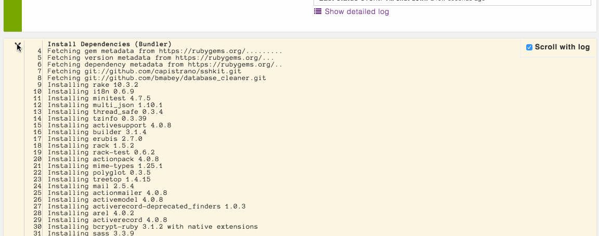

``hfold`` can be used multiple times, and there's a long-hand form which can be
used for multi-line statements.

.. hint::
  RSpec won't colorize output by default unless the output device is a TTY,
  this is good call, but means that CI systems don't get color. We can
  override this, similar too for other programs.  RSpec looks for the
  Environment variable ``SPEC_OPTS`` and we can force color by adding the
  variable ``SPEC_OPTS=--color --tty`` to the environment:

  .. figure:: environments-spec-opts-color-tty.png
    :align: center
    :figclass: align-center

Set up automation triggers
--------------------------

With the build passing, it'd be nice if Harrow could automatically test all new
commits we make, without us having to log in and click "Run Now" from the
dashboard.  Let's setup a Webhook based automation trigger and have Github
notify us when code changes.

We need to go to the *Edit Project* page again and create a new Webhook trigger:

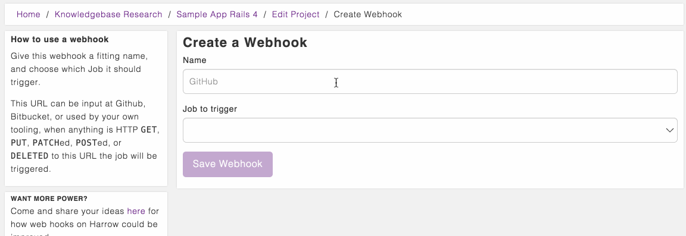

Any requests sent to this URL will be persisted, and will trigger the linked
job.  We could test this on the command line as follows:

.. code-block:: bash

    curl -XPOST https://www.app.harrow.io/api/wh/2cbbf512478175f9

This would trigger our unit test job.  We can give this URL to Github
and they'll ping it for us, whenever we choose:

.. figure:: github-setup-webhook.gif
  :align: center
  :figclass: align-center

We can also configure Harrow to react to new commits, new branches or tags
matching certain patterns, or also for pull requests all using the same
mechanism.  Explore the Github options for webhooks, and `our documentation on
Webhooks`_ for more ideas.

Invite Collaborators
--------------------

With something up and running, even if it is *only* the test suite, we can
invite our colleagues.

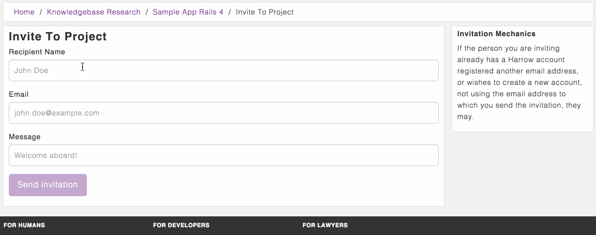

.. hint::
  After inviting Max, he'll be a *member* of our Project, he won't be able to
  edit anything, or create any new tasks or jobs without our permission! We
  can easily give Max more permissions, or change his role in the project from
  the web interface.

Deploying with Capistrano
-------------------------

We're taking a shortcut or two to make this easier for beginners, but the same
principle applies to more complex deployments!

Granting Harrow access to our server
~~~~~~~~~~~~~~~~~~~~~~~~~~~~~~~~~~~~

We generated an SSH key on the `Staging` environment that we setup in Harrow
erlier, now we need to put the public component onto our server.  We're using a
Digital Ocean droplet, but any server with SSH access would be fine.

First we need to pick up the *public* key to grant Harrow access to our staging
server.

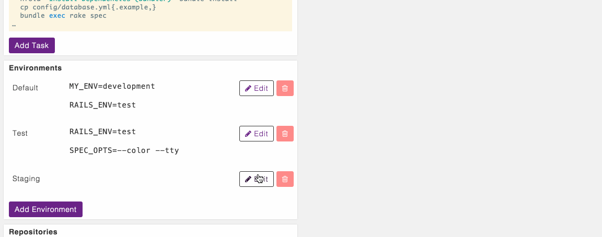

We then append the public key to ``~/.ssh/authorized_keys`` of the
user we want to allow Harrow to log in as, in this case ``root``.

.. warning::
  We're using ``root`` here, don't do that, it's just the Digital Ocean
  defaults. Deploying & running internet-facing daemons as ``root`` is usually asking for
  trouble.

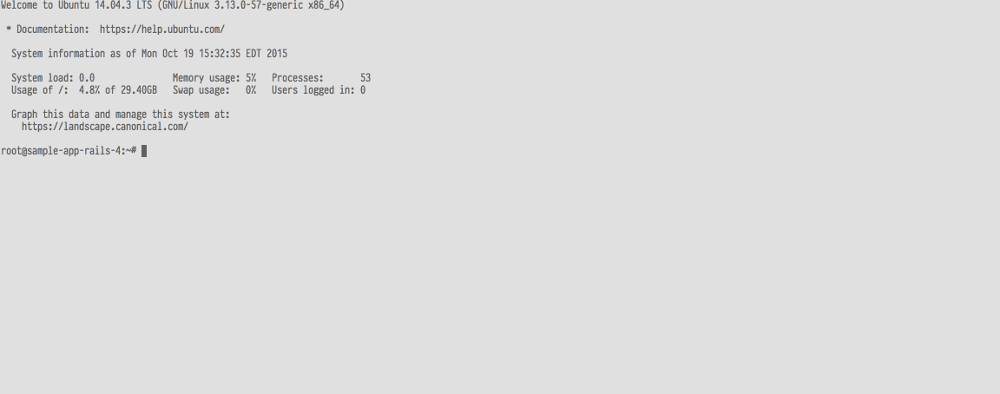

Setting up Harrow and Capistrano
~~~~~~~~~~~~~~~~~~~~~~~~~~~~~~~~

With Harrow granted access to our server, we add another couple of environment
variables to configure Capistrano's behaviour:

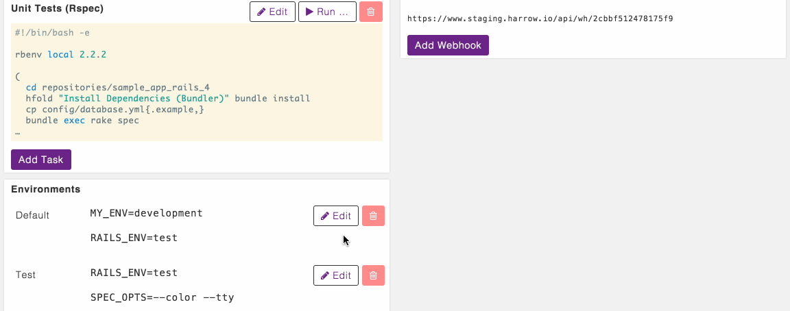

Capistrano is already setup to read its server list from the environment:

.. code-block:: ruby

  # in config/environments/staging.rb
  server "root@#{ENV['SERVER_ADDR']}", roles: %w{app db web}

That takes care of ``SERVER_ADDR``.  If you have a lot of hosts, this might not
make sense and you might just commit ``config/environments/staging.rb`` with a
hard-coded list of hostnames or IP addresses.  This is documented just for
demonstration purposes.

Now, we can define a deployment task which makes use of the things we learned
when writing the unit test task and using `RAILS_ENV` to name the stage to
which Capistrano should deploy:

.. code-block:: bash

  #!/bin/bash -e

  rbenv local 2.2.2

  (
    cd repositories/sample_app_rails_4
    hfold "Installing Figlet (Prints Banners)" sudo apt-get install -y figlet
    hfold "Installing Dependencies (Bundler)" bundle install
    ssh-keyscan -4 "$SERVER_ADDR" > ~/.ssh/known_hosts
    hfold bundle exec cap "$RAILS_ENV" deploy
    # Success Banner
    tput setab 2
    tput setaf 7
    tput bold
    figlet "Deployed $(git rev-parse --short head) sucessfully!"
    tput sgr0
  )

Much of this is familiar, let's review what we've changed to make the deployment task:

1. Dropped copying the ``database.yml`` from the example.
2. Install an Ubuntu package for something called ``figlet``, totally
   unnecessary but it allows us to print a nice success banner in our script.
3. Still use ``bundle install`` to install the Ruby Gem dependencies, this time
   wrapped in an ``hfold``.
4. Use ``ssh-keyscan`` to get the hosts SSH host key, see below for a note
   about security, and to read about why this is required!
6. Run ``cap "$RAILS_ENV" deploy``, we quote the ``"$RAILS_ENV"`` to `prevent
   globbing and word splitting`_, also using ``hfold`` to hide the noisy
   output.
7. Print a nice banner, about the success of our deployment! ``tput`` modifies
   the `brush` in the log viewer, and is mostly just included for fun! There
   are shorter ways to write these commands, but we've used the long-hand for
   clarity.

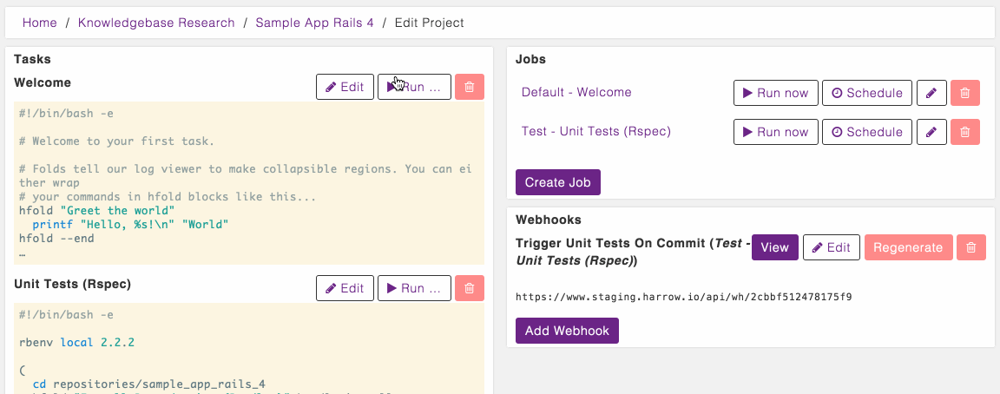

With the task made, we can run it in the staging environment:

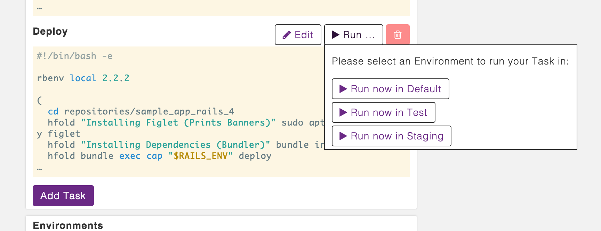

.. hint::
  Harrow takes security really seriously, and by default won't trust unknown
  SSH hosts.  Trusting them offers your SSH keys, and malicious servers could
  steal them.  You should `check our guide on SSH known-hosts`_!

After waiting a few minutes, and maybe running this one or two times, working
out any kinks with user accounts or server permissions, you should see something wonderful:

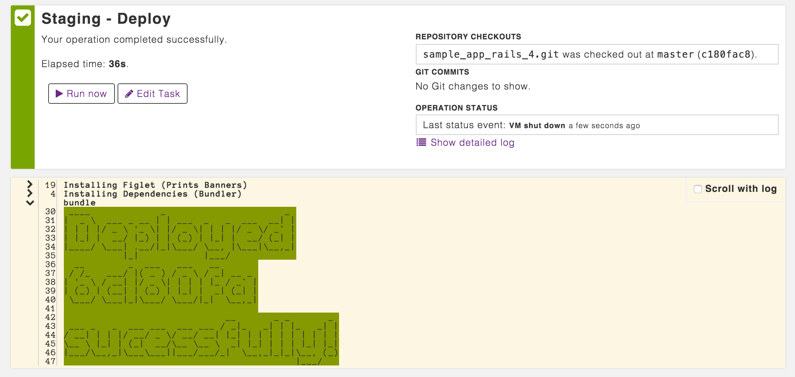

Thanks for following along in the tutorial, if you have any problems following
this guide for your own application, just contact us using the live-chat, or write us a ticket.

.. _Capistrano: https://github.com/capistrano/capistrano
.. _here-document: https://www.gnu.org/software/bash/manual/html_node/Redirections.html#Here-Documents
.. _language runtimes here: ../language-runtimes/index.html
.. _shell brace expansion: https://www.gnu.org/software/bash/manual/html_node/Brace-Expansion.html
.. _subshell: http://www.tldp.org/LDP/abs/html/subshells.html
.. _read more about it here: ../harrow-utilities/hfold.html
.. _check our guide on SSH known-hosts: ../mini-guides/ssh-known-hosts/index.html
.. _databases and services documentation: ../databases-and-services/index.html
.. _our documentation on Webhooks: ../webhooks/index.html
.. _prevent globbing and word splitting: https://github.com/koalaman/shellcheck/wiki/Sc2086
